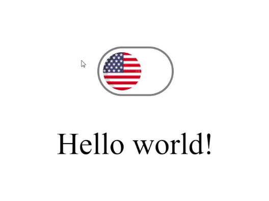

# I18NSwitch

I18NSwitch is a vanilla JavaScript based component to make internationalization using two languages easier on web pages.   Just need to import the javascript and css file on your project and you are ready to go!

This component will automatically change between two languages everytime user clicks on the switch.

 

## Constructor

~~~javascript
const langSwitch = new I18NSwitch(
    {
        firstFlag : 'assets/united-states.png',
        firstI18n : english,
        secondFlag : 'assets/brazil.png',
        secondI18n : portuguese
    }
);
~~~

### firstFlag
Path of the flag image that will represent the first language.

### firstI18n
Object that contains all texts that will be assign to each element on the first language, the properties name must be the same of the correspontent element ID you wish to assign the value.

### secondFlag
Path of the flag image that will represent the second language.

### secondI18n
Object that contains all texts that will be assign to each element on the second language, the properties name must be the same of the correspontent element ID you wish to assign the value.

 

## Functions

### init
Initializes the component.

### isFirstLanguageOn
Returns true if first language is selected

### isSecondLanguageOn
Returns true if second language is selected

## Listener

### onChange
Triggers every change between languages

 

## Example

~~~html
<!DOCTYPE html>
<html>
<head>
    <meta charset="UTF-8">
    <title>I18N switch</title>

    <link rel="stylesheet" href="style/langSwitch.css">

    

</head>
<body>

    <!--
    This div element is where the switch will be built
    -->
    

        

    

    <!--
    This element will recieve text from the component
    -->
    

    
    
</body>
</html>
~~~

And this is how it will looks like:

 

## Mentions
The flag images used on the project and others can be found for free on the following link:
https://www.flaticon.com/packs/country-flags-icons

